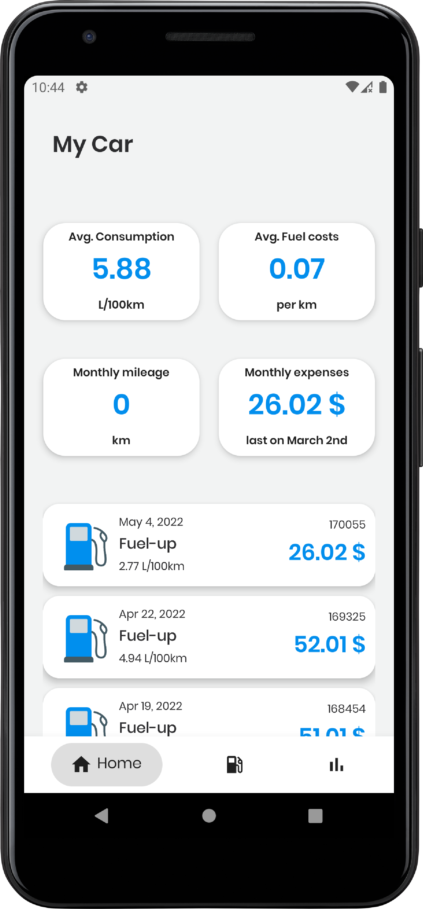
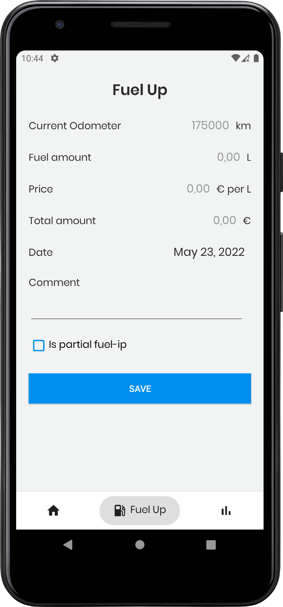
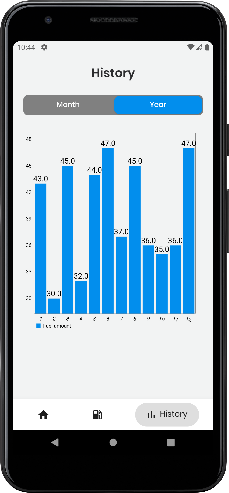

# FuelApp

FuelApp is a mobile app, where you can track and monitor your fuel-ups and average consumption.

&nbsp;&nbsp;&nbsp;&nbsp;

## Images

  &nbsp;&nbsp;&nbsp;&nbsp;
  &nbsp;&nbsp;&nbsp;&nbsp;
  

## With FuelApp you can:
- add fuel up
- monitor your fuel ups 📆
- track average consumption
- track fuel up expenses
- track driven distaces
- track fuel up amounts on bar chart 📉

## Technologies &nbsp;  
This application was developed in [Android Studio](https://developer.android.com/studio?gclid=CjwKCAiAp8iMBhAqEiwAJb94z6ZmJelUIRcPHgbT2dTslqxP7tYruFIRXo57xC4Q131Nxw0lFSd4fRoCGqcQAvD_BwE&gclsrc=aw.ds). with programming language called [Kotlin](https://kotlinlang.org/).
 
## Authors 👋
This app was developed by [Blaž Čerpnjak](https://github.com/blaz-cerpnjak) and Timi Poredoš at Faculty of Electrical Engineering, Computer Science and Informatics, University of Maribor.
